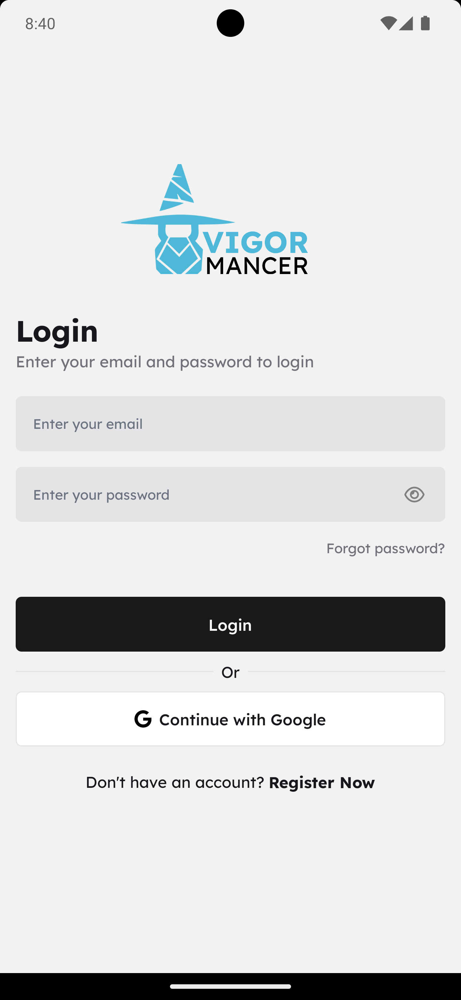

# Vigormancer

**Vigormancer** is a project for organizing weight training, aimed at facilitating the creation and monitoring of personalized workouts. The project is developed in React Native, focusing on simplicity and usability, allowing users to create workouts quickly and easily.

## 🚀 Features

- [x] Create and manage workouts
- [x] Add exercises to workouts
- [x] Add sets and reps to exercises
- [x] Streak monitoring
- [x] Exercise history
- [x] Weight tracking and progress
- [x] BMI tracking
- [x] User authentication using Clerk
- [x] Dark mode
- [x] Responsive design
- [x] Internationalization support

## ❇️ Technologies Used

- [React Native](https://reactnative.dev/) - A framework for building native apps using React
- [Expo](https://expo.dev/) - A framework and platform for universal React applications
- [Clerk](https://clerk.dev/) - User authentication and management
- [Tailwind CSS](https://tailwindcss.com/) - A utility-first CSS framework for styling
- [React Navigation](https://reactnavigation.org/) - Routing and navigation for React Native
- [React Query](https://react-query.tanstack.com/) - Data fetching and state management
- [Zustand](https://github.com/pmndrs/zustand) - A small, fast, and scalable bearbones state-management solution
- [React Native Reanimated](https://docs.swmansion.com/react-native-reanimated/) - A React Native library for animations
- [React Native Gesture Handler](https://docs.swmansion.com/react-native-gesture-handler/) - A library for handling gestures in React Native
- [React Native Reusables](https://github.com/mrzachnugent/react-native-reusables) - A collection of reusable components for React Native

## 📱 Screenshots

    
    &nbsp;&nbsp;
    
    &nbsp;&nbsp;
    
    &nbsp;&nbsp;
    
    &nbsp;&nbsp;
    
    &nbsp;&nbsp;
    

## 🖊️ Author

This project is developed by [Ranielli Montagna](https://github.com/RanielliMontagna)

## 📄 License

This project is licensed under the MIT License. See the [LICENSE](LICENSE) file for details.
